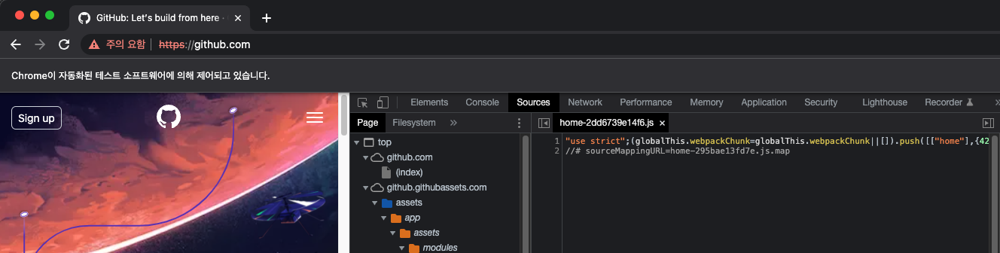
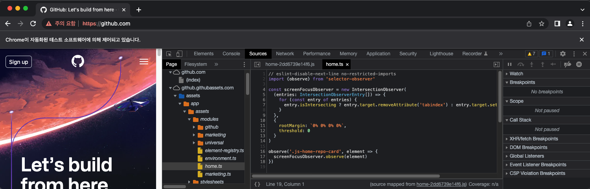

# pysourcemapper

This repository will be inject `sourceMappingURL` on all of the javascript extension for forcing mapping with source map files.


You can see on Sources panel as directory of orange colored when it mapped.

## Requirements
* Python 3.7.3 or higher.
* Chromedriver with matched version on your installed chrome.

## Installation
```bash
pip install -r requirements.txt
```

## Usage
```bash
$ python app.py "https://nopsled.tistory.com"
# open with url (url should be start with `http://` or `https://` scheme)
```

```bash
$ python app.py
# just open the chromedriver
```

## Issues
* Sometimes integrity mismatch on script tag (e.g. jQuery cdn)


## License
Distributed under the MIT license.